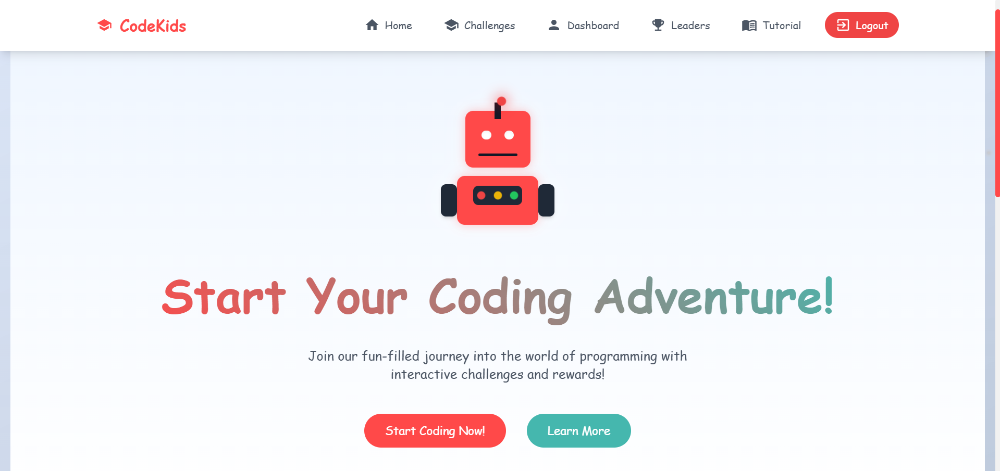
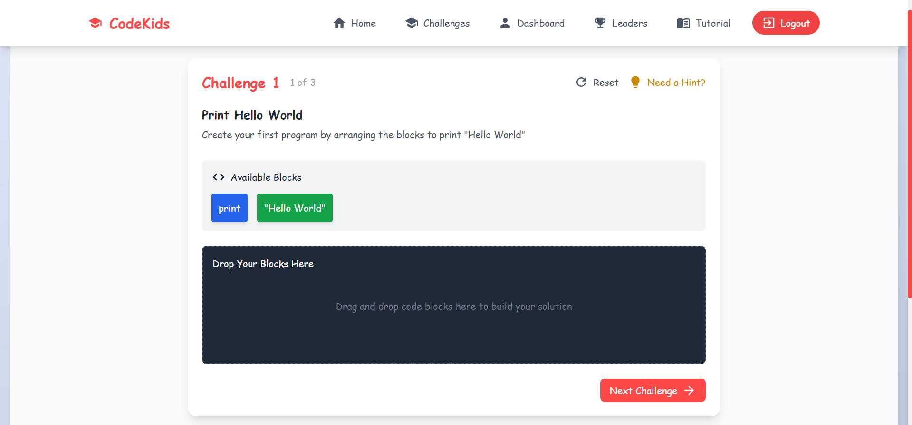
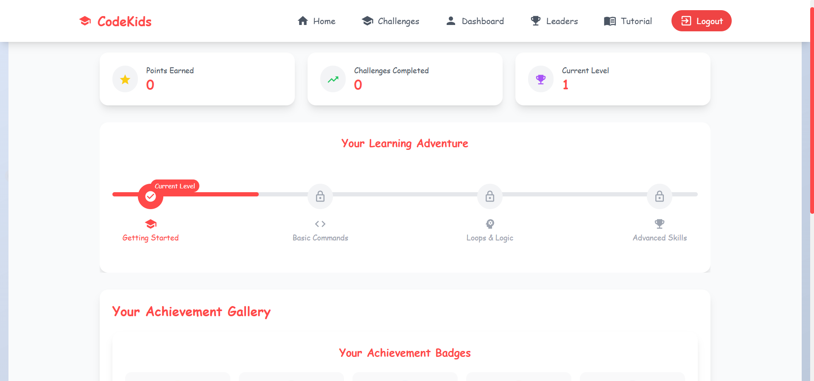

# CodeKids - Gamified Coding Learning Platform

## 📚 Overview

**CodeKids** is a fun and interactive platform built to introduce kids aged 7–14 to the world of programming through a gamified experience. With drag-and-drop coding blocks, mascot-guided learning, and rewarding challenges, CodeKids makes the learning journey engaging and exciting!

## ✨ Features

- 🧩 **Drag-and-Drop Coding Blocks** – Easy visual coding for beginners  
- 🎮 **Gamified Challenges** – Practice with real-world scenarios turned into fun puzzles  
- 🏅 **Progress Visualization** – Track learning milestones and achievements  
- 🤖 **Interactive Mascot** – A friendly robot that guides and encourages learners  
- 📈 **Points & Badges System** – Reward-based learning to motivate kids  
- 🧠 **Responsive UI** – Fully optimized for both desktop and tablet devices  
- 🔒 **Cookie-based Authentication** – Seamless login and session handling  

> ⚠️ **Note:** This project currently includes only the **frontend** (`codekids/Frontend`). Backend integration is planned for future development.

## 🛠️ Tech Stack

- **Frontend**: React + Vite  
- **Animations**: Framer Motion  
- **Styling**: Tailwind CSS + Material UI  
- **UI Components**: ShadCN UI  
- **Routing**: React Router DOM  
- **State Management**: React Context API  
- **Auth**: Cookie-based Auth with React hooks  

## 📷 Screenshots

  
  
  

## 🚀 Getting Started

### Prerequisites

- [Node.js](https://nodejs.org/) (v16 or later)  
- npm or yarn  

### Installation

1. **Clone the repo**
   ```bash
   git clone https://github.com/parth5409/codekids.git
   cd codekids/Frontend
   ```

2. **Install dependencies**
   ```bash
   npm install
   # or
   yarn install
   ```

3. **Start the development server**
   ```bash
   npm run dev
   # or
   yarn dev
   ```

4. **Visit the app in your browser**
   ```
   http://localhost:5173
   ```

## 📁 Project Structure

```
codekids/
├── Frontend/              # Frontend React app
│   ├── public/            # Static assets
│   ├── src/
│   │   ├── components/    # Reusable components
│   │   │   ├── auth/      # Login & Signup UI
│   │   │   ├── common/    # Mascot, buttons, etc.
│   │   │   ├── dashboard/ # Progress tracking and UI
│   │   │   └── challenges/# Drag-and-drop coding blocks
│   │   ├── context/       # AppContext for global state
│   │   ├── pages/         # Route-based pages
│   │   ├── App.jsx        # Root component
│   │   ├── main.jsx       # Entry point
│   │   └── assets/        # Images, icons, and logos
│   ├── index.html
│   ├── tailwind.config.js
│   ├── vite.config.js
│   ├── package.json
│   └── README.md
└── Backend/               # (Planned for future)
```

## 📜 Available Scripts

- `npm run dev` – Launch development server  
- `npm run build` – Generate production-ready build  
- `npm run preview` – Preview production build locally  

## 🤝 Contributing

1. Fork the repository  
2. Create your feature branch  
   ```bash
   git checkout -b feature/amazing-feature
   ```
3. Commit your changes  
   ```bash
   git commit -m "Add amazing feature"
   ```
4. Push and open a Pull Request  
   ```bash
   git push origin feature/amazing-feature
   ```

## 🙌 Acknowledgments

- [React](https://reactjs.org/)  
- [Tailwind CSS](https://tailwindcss.com/)  
- [Material UI](https://mui.com/)  
- [Framer Motion](https://www.framer.com/motion/)  
- [ShadCN UI](https://ui.shadcn.dev/)  
- [Vite](https://vitejs.dev/)  

## 📬 Contact

**Parth Ravindra Gaikwad**  
📧 parthgaikwad5409@.com  
🔗 [LinkedIn](https://linkedin.com/in/parthgaikwad09)  
💻 [GitHub](https://github.com/parth5409)  

Project Link: [https://github.com/parth5409/codekids](https://github.com/parth5409/codekids)